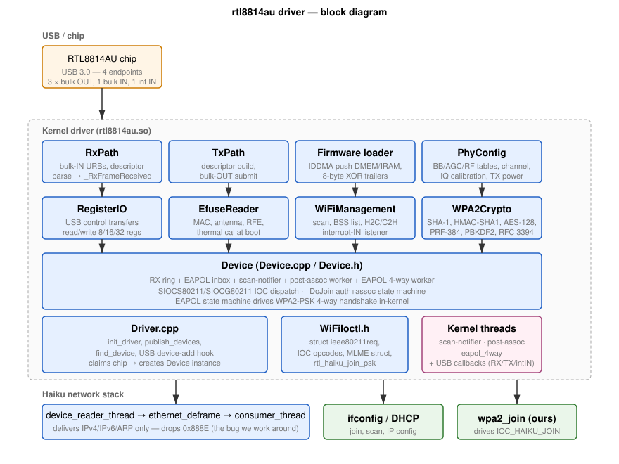

>[!NOTE]
>An LLM was used to aid in development of this code.

# Architecture

The rtl8814au driver is a Haiku kernel add-on that talks to the Realtek
RTL8814AU chipset over USB.  It implements the full 802.11 station path
in-driver: scanning, association, an in-driver WPA2-PSK 4-way handshake,
and the data path to/from Haiku's network stack.

## Block diagram

## Components

The driver is intentionally split into small classes, each owning one
piece of state:

| Class / file | Responsibility |
|---|---|
| `Driver.cpp` | Kernel entry points (`init_driver`, `publish_devices`, `find_device`).  USB device-add hook claims the chip and creates a `RTL8814AUDevice`. |
| `Device.cpp / Device.h` | The whole-device class — owns USB endpoints, hardware state, the RX ring, and all the kernel threads.  Most logic lives here. |
| `RegisterIO.cpp` | Read/Write 8/16/32-bit MAC, BB, and RF registers via USB control transfers.  Single point of contact with the chip's register bus. |
| `Firmware.cpp` | Loads the 8814AU firmware blob (`rtl8814aufw.bin`) into the chip's MCU via IDDMA.  See [firmware.md](firmware.md). |
| `EfuseReader.cpp` | Reads the chip's electronic fuses (PROM equivalent) — MAC address, antenna config, RFE type, etc. |
| `PhyConfig.cpp` | BB / RF / AGC table replay (cold-start sequence borrowed from morrownr/8814au), channel select, IQ calibration. |
| `TxPath.cpp` | TX descriptor build, USB bulk-OUT submission, queue management. |
| `RxPath.cpp` | USB bulk-IN submission, RX-descriptor parsing, frame dispatch into `_RxFrameReceived`. |
| `WiFiManagement.cpp` | High-level 802.11 management: scan state, BSS list, H2C/C2H mailbox to firmware, EAPOL diversion glue. |
| `WPA2Crypto.cpp` | Standalone crypto primitives: SHA-1, HMAC-SHA1, AES-128, RFC 3394 unwrap, PRF-384, PBKDF2.  No allocations.  See [wpa2-in-driver.md](wpa2-in-driver.md). |
| `WiFiIoctl.h` | Shared ioctl definitions — duplicates a subset of FreeBSD's `<net80211/ieee80211_ioctl.h>` since we can't pull that into kernel context. |

## Threading model

The driver runs lock-free in most paths and uses `mutex fLock` for the
small amount of shared state.  Threads:

| Thread | Owns | Wakes on |
|---|---|---|
| **USB bulk-IN callback** | `_RxFrameReceived` dispatch | USB completion |
| **USB bulk-OUT callback** | TX completion | USB completion |
| **WiFi management interrupt-IN** | C2H mailbox events from firmware | USB completion |
| **Scan notifier** (one-shot) | Publishes `B_NETWORK_WLAN_SCANNED` | 8-sec timeout (firmware C2H scan-done event isn't wired) |
| **Post-assoc worker** | RA_INFO + MEDIA_STATUS_RPT H2C — runs from a context that can do synchronous USB control transfers, unlike the bulk-IN callback | `fPostAssocSem` released by `_HandleAssocResponse` |
| **EAPOL 4-way handshake worker** | Drains `fEapolInbox`, runs the in-driver WPA2 state machine | `fEapolReady` released by `_RxFrameReceived` when ethertype is 0x888E |

The two USB callbacks run in the USB stack's context — they must not
block on synchronous control transfers.  Anything that needs to do
a control transfer (programming the chip CAM after a handshake
completes, sending H2C commands) is handed off to the post-assoc
worker or the EAPOL worker via a semaphore.

SW CCMP encrypt + decrypt for the data path run inline in the TX
and RX callbacks since both are bounded work (~150 ns/AES-block on
modern x86) and a context-switch would dwarf the cost.  See
[wpa2-in-driver.md](wpa2-in-driver.md) for why the data path
encrypts in software rather than in the chip's HW crypto engine.

## State machine

The driver has two state variables that together describe where we
are in the connection process:

- `fJoinState` — `kJoinIdle` / `kJoinAuthenticating` / `kJoinAssociating` /
  `kJoinConnected`.  Drives the auth + assoc state machine.
- `fEapolState` — `kEapolIdle` / `kEapolWaitM1` / `kEapolWaitM3` /
  `kEapolDone`.  Drives the in-driver WPA2 handshake.

A successful WPA2 join walks both: `kJoinIdle → kJoinAuthenticating →
kJoinAssociating → kJoinConnected` and then `kEapolIdle → kEapolWaitM1 →
kEapolWaitM3 → kEapolDone`.

## IOC interface

The driver exposes itself through the standard Haiku character-device
interface plus the freebsd_wlan-style 802.11 IOCs.  See
[ioctl-reference.md](ioctl-reference.md) for the per-IOC behavior.

The callers we deal with are:

- **Userland tools** (`ifconfig`, and a small helper that issues the
  rich `IOC_HAIKU_JOIN` for WPA2-PSK setup) — open
  `/dev/net/rtl8814au/0` directly and issue `SIOCS80211` /
  `SIOCG80211` ioctls on that fd.
- **`wpa_supplicant`** via Haiku's `net_server` — issues the same
  ioctls but goes through the `freebsd_wlan` userland glue.  The
  driver supports enough of its init sequence that it doesn't bail
  (`IOC_ROAMING`, `IOC_PRIVACY`, `IOC_WPA`, `IOC_DEVCAPS`,
  `SIOCSIFMEDIA`...), but the 4-way handshake itself is **not** done
  via `wpa_supplicant` because Haiku's network stack drops EAPOL
  frames before they reach `wpa_supplicant`'s `AF_LINK` packet
  socket.  See [wpa2-in-driver.md](wpa2-in-driver.md).

## Why not use the FreeBSD `net80211` compat layer?

Most other Haiku Wi-Fi drivers (atheroswifi, ralinkwifi, marvell88w8363,
broadcom43xx, iprowifi*) use the `src/libs/compat/freebsd_wlan/`
compatibility shim, which provides a faithful FreeBSD `net80211`
implementation including a STA state machine, scanning, and the
ioctl interface.

We don't because:

1.  **Realtek doesn't ship a FreeBSD driver for the 8814AU.**  Reference
    code comes from morrownr's Linux fork, which uses `mac80211` —
    not net80211.  Porting that would be a much larger lift than just
    writing the management state machine ourselves.
2.  **The 8814AU's firmware does some things differently** (TX descriptor
    layout, H2C/C2H protocol, channel selection) that don't map cleanly
    onto the existing FreeBSD `net80211` chip-side hooks.
3.  **We get to be small.**  The whole driver compiles in under 200 KB
    and depends on no external compat layers — just the standard kernel
    USB and network APIs.  That makes the standalone .hpkg
    self-contained.

The trade-off is we duplicate effort for the management state machine
and the EAPOL crypto.  The management code is a few hundred lines
(`WiFiManagement.cpp` + the auth/assoc/MLME branches in `Device.cpp`);
the crypto is `WPA2Crypto.cpp`.  Both are well-tested by RFCs and
straightforward to verify against test vectors.
