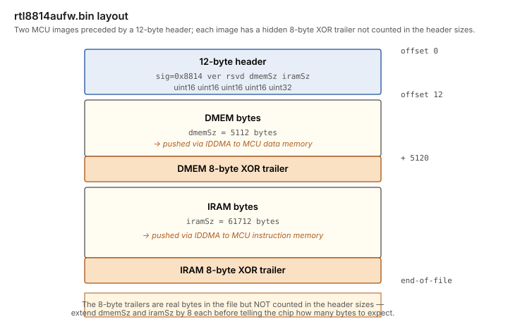

# Firmware

The RTL8814AU has an on-chip Lexra 3081 MIPS MCU that runs firmware
loaded by the host driver at startup.  The firmware blob ships as
`/boot/system/data/firmware/rtl8814au/rtl8814aufw.bin` (~67 KB).

## Blob layout

The 12-byte header declares two image sizes — DMEM (5112 bytes) and
IRAM (61712 bytes) — but each image is followed in the file by an
8-byte XOR trailer that is **not** included in the header's stated
size.  The driver must extend `dmem_size` and `iram_size` by 8 each
before telling the chip how many bytes to expect via IDDMA.  Without
this, the chip's checksum poll fails and `CPU_DL_READY` never
asserts.

This was the primary bring-up gotcha — the morrownr Linux reference
driver hides it inside a helper that adds the 8 bytes implicitly, so
it isn't visible in any obvious place in the reference code.

## IDDMA load procedure

Programming sequence (mirrored from morrownr/8814au, written from
scratch in `Firmware.cpp`):

1.  Enable download mode: write `REG_MCUFWDL = 0x2001`.
2.  Halt the MCU: clear `SYS_FUNC_EN` BIT 10.
3.  Reset the IDDMA engine: `REG_CPU_DMEM_CON = 0x00010000`,
    `DDMA_CH0_CTRL = 0`.
4.  Enable IDDMA: set `REG_CR + 1` BIT 0 (`0x60 → 0x61`).
5.  Prepare the beacon queue (the IDDMA load uses the same TX
    descriptor path).
6.  Clear `ENDPOINT_HALT` on bulk-OUT pipe 0.
7.  For each section (DMEM, then IRAM):
    - Cycle CHKSUM_RST without OWN to clear the stale accumulator.
    - Write `REG_CPU_DMEM_CON` to point at the right destination
      offset.
    - Push the section bytes (including the 8-byte trailer!) via
      bulk-OUT with the right TX descriptor type.
    - Poll `REG_CPU_DMEM_CON` for the ready flag (DMEM_DL_RDY for
      DMEM, IMEM_DL_RDY for IRAM).
8.  Set the firmware-ready flag in `REG_MCUFWDL`.
9.  Resume the MCU: set `SYS_FUNC_EN` BIT 10.
10. Poll `REG_MCUFWDL` for `CPU_DL_READY`.

When `CPU_DL_READY` asserts (typically after one poll once the
trailer bytes are included), the firmware is alive and serving
H2C/C2H mailbox traffic.

## H2C and C2H

Once running, the firmware exposes a host-to-card / card-to-host
mailbox protocol:

- **H2C** (host → card) commands go via 8-byte writes to a mailbox
  region.  We use them for `RA_INFO` (rate adaptation) and
  `MEDIA_STATUS_RPT` (connect/disconnect notification) in the
  post-assoc worker.
- **C2H** (card → host) events come back over the USB interrupt-IN
  endpoint as 4+N-byte messages.  We listen for them in
  `WiFiManagement.cpp` but currently don't dispatch on most.

The firmware also handles per-packet TX rate selection and AMPDU
aggregation.  CCMP encryption is **not** performed by the firmware
in this driver — the chip's hardware crypto engine declined to engage
for our SECCFG / CAM programming despite matching the morrownr
Linux reference, so the data path runs AES-CCMP in software on the
host instead.  See [wpa2-in-driver.md](wpa2-in-driver.md) for the
full story.

The security CAM is still programmed (CAM[1] = GTK with the group
flag, CAM[4] = pairwise TK) — harmless when SECCFG=0, and useful
future-proofing if a chip configuration we haven't found turns out
to make the HW engine cooperate.

## Licence and provenance

**The blob is Realtek's and is not GPL.** It is redistributed under Realtek's
own binary redistribution licence, shipped as
`firmware/LICENCE.rtlwifi_firmware.txt` and included in the `.hpkg` beside the
driver's own `LICENSE`. The operative requirement is short:

> Redistributions must reproduce the above copyright notice and the following
> disclaimer in the documentation and/or other materials provided with the
> distribution.

So the licence file has to travel with the package; shipping only the driver's
GPL text is not sufficient, because the GPL does not cover the firmware. The
same licence forbids reverse engineering, decompilation and disassembly. This
project does none of those -- the layout documented above is the blob's **load
container** (header, section sizes, trailers), which is what a host driver must
parse to load the firmware as intended. The MCU code inside is opaque here and
is never decoded.

Haiku knows this licence too: `/system/data/licenses/Realtek WiFi Firmware`
carries the same text (its copyright line reads 2010-2019 rather than 2010).
That is the name the package declares, so it matches platform convention.

Declaring it is not enough on its own. `package create` validates every name
in `licenses` against the **package's own contents**, not against the host
system, so a name it does not recognise as one of its built-in standard
licences must be shipped at `data/licenses/<exact name>` or the build fails
with `License '...' isn't contained in package!`. `GNU GPL v2` is recognised
and needs no file; `Realtek WiFi Firmware` is not, despite an installed Haiku
having it. The package therefore ships the text twice: once at
`data/licenses/Realtek WiFi Firmware` to satisfy the package kit, and once
under `data/documentation/packages/rtl8814au/` where a user will find it. The
happy consequence is that the notice travels inside the `.hpkg` instead of
depending on the host, which is what Realtek's terms require.

`linux-firmware` is the authority for these terms. Its `WHENCE` lists
`rtw88/rtw8814a_fw.bin` among the Realtek files and declares:

> Licence: Redistributable. See LICENCE.rtlwifi_firmware.txt for details.

Note that Realtek is inconsistent about this. The vendor Linux driver embeds
the same class of firmware in `hal/rtl8814a/hal8814a_fw.c`, and *that file*
carries a GPL v2 header with a Realtek copyright. The blob itself is a binary
with no source, and `linux-firmware`'s narrower "redistributable, no reverse
engineering" terms are the conservative reading, so those are the terms this
project honours.

### Which build this actually is, and what is not known

| | size | header version field |
|---|---|---|
| **ours**, `firmware/rtl8814aufw.bin` | 66,904 | 25 |
| `linux-firmware` `rtw88/rtw8814a_fw.bin` | 68,320 | 33 |
| vendor driver `array_mp_8814a_fw_nic` | 68,320 | 33 |

All three carry the same `0x8814` signature. The vendor array and the
`linux-firmware` blob are **byte-identical**; ours is **a different, older
Realtek build** -- it shares only the first four bytes with them.

**The repository does not record which Realtek release ours came from.** The
commit that introduced it (`01bbb23`) carried it over from the in-tree Haiku
fork without noting an origin, and the bring-up work involved USB captures of
the vendor driver as well as reading its source, so either is possible.

That is a gap worth closing, and the obvious way to close it is to **move to
the `linux-firmware` blob**, which has documented provenance and a stated
licence attached to that exact file. It is a different firmware version, so it
is a change that needs hardware testing rather than a drop-in swap -- the
header parsing above is version-independent, but nothing else should be
assumed. Until then the licence terms are honoured on the basis that this is
Realtek RTL8814A firmware of the same class, which is what the signature and
the load protocol both say it is.
