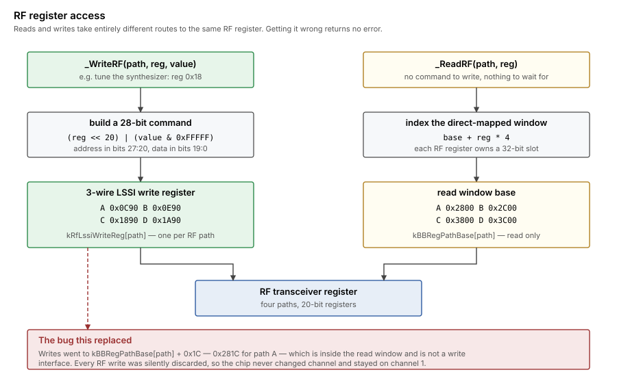
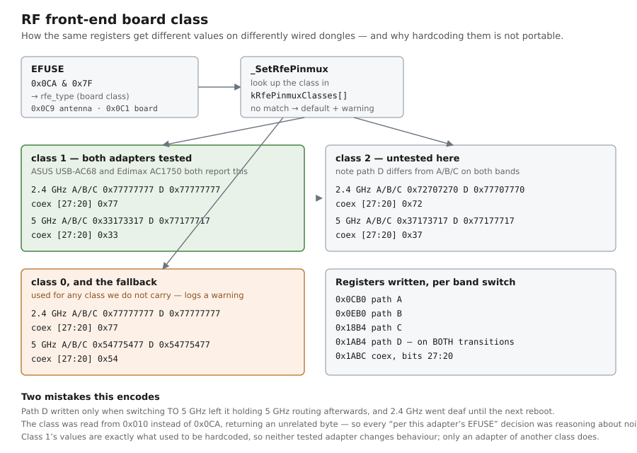

# Channel and band programming

How the driver tunes the radio: the two completely different routes to an
RF register, what a channel change actually entails, and what changes on
top of that when crossing between 2.4 GHz and 5 GHz.

Everything here lives in `PhyConfig.cpp`.  The register addresses are in
`RTL8814AU.h`.

## RF register access — two routes, not one



Reads and writes take entirely different paths to the same RF register,
and this is the single easiest thing to get wrong in this driver, because
getting it wrong is **silent**.  Nothing returns an error.

**Writing** goes through the per-path 3-wire LSSI write register:

| Path | Register |
|---|---|
| A | `0x0C90` |
| B | `0x0E90` |
| C | `0x1890` |
| D | `0x1A90` |

The RF register address goes in bits 27:20 and the 20-bit value in bits
19:0, the whole command masked to 28 bits:

```
command = ((rfRegister << 20) | (value & 0xFFFFF)) & 0x0FFFFFFF
```

**Reading** is a direct-mapped window, one per path, where each RF
register owns its own 32-bit slot:

```
address = kBBRegPathBase[path] + rfRegister * 4
```

with `kBBRegPathBase` = `0x2800`, `0x2C00`, `0x3800`, `0x3C00`.  There is
no command to write and nothing to wait for.

`kBBRegPathBase` is *only* the read window.  It is not a general per-path
register block, and an RF write aimed into it lands on an unrelated
address and is quietly discarded.

### The bug this replaced

`_WriteRF` used to write the command to `kBBRegPathBase[path] + 0x1C` —
`0x281C` for path A — which is inside the read window and is not a write
interface at all.  **Every RF write the driver ever issued was silently
discarded.**

The chip therefore never changed channel: it stayed wherever the init
tables left it, which is channel 1.  2.4 GHz appeared to work only because
the test network happened to sit on channel 1.  The tell, in hindsight, was
that across 43 harvested BSS entries there was never one on channel 6 or
channel 11, which is not a plausible neighbourhood.

`_ReadRF` was independently wrong: it wrote a command to
`kBBRegPathBase[path] + 0x20` and read `+ 0x24`, which is simply the slot
for RF register 9.  It returned a constant, which is why `RF18` read back
as `0x00000` no matter what had been programmed.

Both are fixed.  A useful sanity check, since the read path now works:
reading RF register `0x18` on path A should return `0x13124` on channel 36
and `0x53195` on channel 149.

## What a channel change entails

`SetChannel` does five things, in this order.  The order matters: the
band switch must land before the synthesizer is tuned, so the demodulator
is never running against a half-configured band.

1. **Band switch**, if the band changed — see below.
2. **fc_area filter** (`0x0860`, bits 28:17).  Steps at 5 GHz sub-band
   boundaries, so it is per channel, not per band.
3. **RF synthesizer** (`0x18`) on every path.
4. **AGC table select** (`0x0958`, bits 4:0) for 5 GHz sub-bands.  2.4 GHz
   uses table 0, which the band switch already set.
5. **Bandwidth** and **per-channel TX power**, unchanged from before.

### The synthesizer register carries the band

RF register `0x18` holds the channel number in its low byte *and* a
band-select code in bits 18:16 and 9:8.  This is the part that made 5 GHz
impossible before it was understood: the code is **all zeros across
2.4 GHz**, so writing a bare channel number is correct there and can never
be correct anywhere else.

| Channels | Code (positioned) | Constant |
|---|---|---|
| 1–14 | `0x00000` | `kRfModAg2_4GHz` |
| 36–64 | `0x10100` | `kRfModAgBand1` |
| 100–140 | `0x30100` | `kRfModAgBand3` |
| > 140 | `0x50100` | `kRfModAgBand4` |

Written as a read-modify-write under `kRfChannelBandMask`
(`0x000703FF`), because `_SetBandwidth` keeps the filter bandwidth in
bits 11:10 of the same register.

### Per-channel-group values

| Channels | fc_area | AGC table |
|---|---|---|
| 1–14 | `0x96A` | 0 |
| 36–48 | `0x494` | 1 |
| 50–64 | `0x453` | 1 |
| 100–116 | `0x452` | 2 |
| 118–144 | `0x412` | 2 |
| ≥ 149 | `0x412` | 3 |

Both are shifted into place by their masks — `kBBFcAreaMask` and
`kBBAgcTableSelectMask`.

## The band switch

`_SwitchBand` runs only on an actual 2.4 ↔ 5 GHz change.

**RF front-end routing** (`_SetRfePinmux`) comes first: everything after
it is demodulator configuration, and demodulating a band the antenna path
cannot deliver is pointless.  These registers connect the chip's RF pins
to the dongle's external LNA, PA and antenna switch, and the 2.4 GHz
routing physically cannot deliver 5 GHz to the receiver.



The routing depends on the board's **RF front-end class**, read from EFUSE
`0x0CA` and masked with `0x7F`.  This is the chip's own mechanism for coping
with differently wired boards: the same registers want different values
depending on how the dongle is built, so a single hardcoded set is only ever
correct for adapters that share a class with the one it was derived from.

Both adapters tested here — an ASUS USB-AC68 and an Edimax AC1750 — report
class **1**:

| Band | Paths A/B/C (`0x0CB0`, `0x0EB0`, `0x18B4`) | Path D (`0x1AB4`) | Coex (`0x1ABC`, bits 27:20) |
|---|---|---|---|
| 2.4 GHz | `0x77777777` | `0x77777777` | `0x77` |
| 5 GHz | `0x33173317` | `0x77177717` | `0x33` |

Confirmed independently by decoding a usbmon capture of the vendor driver on
the Edimax, which settles on exactly these values.

`_SetRfePinmux` carries the classes the vendor driver distinguishes (1, 2, and
0/default) and selects by the EFUSE value.  An adapter reporting a class we do
not carry falls back to the default routing **and logs a warning**, because
applying one board's routing to another is a plausible way to produce an
adapter that associates and then carries no data — the single hardest failure
here to attribute.

Path D is written on both transitions.  Writing it only when switching *to*
5 GHz leaves it holding 5 GHz routing afterwards, which kills 2.4 GHz receive
until the next reboot.

**Demodulator configuration** then differs by band, because CCK does not
exist above 2.4 GHz:

| Register | 2.4 GHz | 5 GHz |
|---|---|---|
| `CCK_CHECK` (`0x0454`) | `0x00` | `0x80` |
| `OFDMCCK_EN` (`0x0808`, bits 29:28) | OFDM + CCK | OFDM only |
| CCK TX (`0x0A80`, bit 18) | 0 | 1 |
| AGC table select (`0x0958`) | 0 | set per channel |

Bit 18 of `0x0A80` keeps the CCK transmitter reachable even with CCK
switched off, which is what the reference does.

LNA mode and the band's AGC gain-curve table (`kAGCTable2G` /
`kAGCTable5G`) are reloaded as they always were.

`_SwitchBand` finishes by reading back what landed and logging it.  BB
writes on this chip have a history of being silently dropped, so a band
switch that only *claims* to have happened is worth nothing.

## Two things we deliberately do not do

The reference driver's `PHY_SwitchWirelessBand8814A` does two more things
that we leave alone on purpose.

**It does not gate the CCK/OFDM clock.**  The reference brackets a band
switch by dropping `0x1000[16]` and restoring it afterwards.  On this chip
that bit is BIT0 of byte `0x1002`, and BB-region writes only land while
`0x1002` reads `0x03` (`FEN_BBRSTB` together with `FEN_BB_GLB_RSTn`) —
see `notes/rtl8814au/05-the-bb-write-lock.md`, where this exact clock-gate
pattern is recorded as a false lead that cost a lot of time.  Gating there
would leave `0x1002` at `0x02` for precisely the window in which every
write in the band switch happens, and they would all be dropped.

This was not theoretical: an earlier version of `_SwitchBand` did gate the
clock, and the readbacks showed the band switch had changed nothing.

**It does not touch the TX/RX path masks** (`0x080C`, `0x0A04`) beyond the
one band bit in `0x080C`.  These are left to the PHY initialisation replay,
which is what the vendor's own cold-start sequence programs them with.

`0x0A04` used to be overwritten with a hardcoded `0x46ff800c` after init.
That value was taken from the middle of the vendor's sequence, which writes
the register four times — `0x46ff800c`, `0x46ff800c`, `0x45ff800c`,
`0x45ff800c` — so the override was undoing the last two writes of the very
trace it claimed to be following.  The rule that came out of it: do not layer
hand-derived register constants on top of the init replay.  The replay is the
per-device mechanism; if it leaves a register wrong, fix the replay.

Also checked and found *not* to matter at 20 MHz: the reference's
`phy_SetBwRegAdc_8814A` and `phy_SetBwRegAgc_8814A` write identical
values for both bands at 20 MHz (`0x8AC` bits 1:0 = 0, `0x82C` bits 15:12
= 6), so they are band-independent for us and are not implemented.

## Status

5 GHz receive works.  A full sweep harvests channels 6, 11, 149 and 157 —
none of which the chip had ever visited — and scan results went from 10 to
22 networks on the same bench.

What has *not* been exercised: associating with, authenticating to, or
passing traffic over a 5 GHz network.  Only receive is proven.  40 and
80 MHz bandwidths remain untested on either band.

## Reference material

Realtek publishes no register-level documentation for this part.
`~/Code/RefDocs/Wireless/Realtek/` has an RTL8812AU datasheet, but it is a
product brief — no `0x454`, no `CCK_CHECK`, no RFE.

The two sources actually used:

- **morrownr/8814au** (`hal/rtl8814a/rtl8814a_phycfg.c`) — GPL, used as a
  logic reference only, never copied.  `PHY_SwitchWirelessBand8814A`,
  `phy_SwChnl8814A`, `PHY_SetRFEReg8814A`, `phy_RFWrite_8814A` and
  `phy_RFRead_8814A` are the relevant functions.
- **FreeBSD `sys/dev/rtwn/rtl8812a`** — BSD-licensed, same Jaguar PHY
  generation, so genuinely portable rather than merely readable.
  `r12a_chan.c`'s `r12a_set_band_2ghz` / `r12a_set_band_5ghz` corroborate
  the sequence, and notably perform no clock gating either.

FreeBSD additionally programs `BW_INDICATION` and `PWED_TH` per band and
waits for `TXPKT_EMPTY` to drain after writing `CCK_CHECK`.  Those have no
8814A equivalent implemented here, and 5 GHz receive works without them;
they are worth revisiting if 5 GHz association misbehaves.
