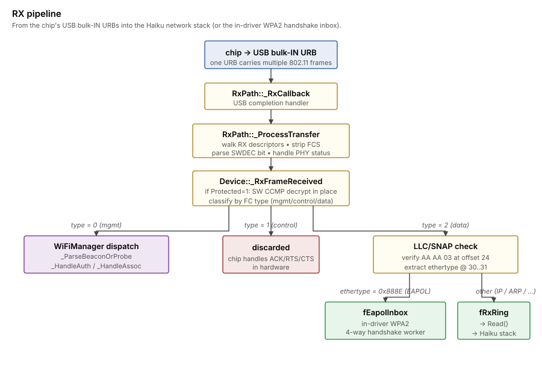

>[!NOTE]
>An LLM was used to aid in development of this code.

# RX path

How frames flow from the air into Haiku's network stack.

## Pipeline



A USB bulk-IN URB lands in `RxPath::_RxCallback`, gets walked into
individual 802.11 frames by `_ProcessTransfer` (which also strips
the 4-byte trailing FCS the chip appends per
`RCR_APPFCS`), and each frame is handed to `Device::_RxFrameReceived`.

`_RxFrameReceived` first applies SW CCMP decryption to any frame with
the Protected bit set (since the chip's HW decrypt engine doesn't
engage in our setup — see
[wpa2-in-driver.md](wpa2-in-driver.md)).  Then it dispatches by
frame type: management frames go to the WiFi manager, control
frames are dropped (chip handles those in hardware), and data
frames go through LLC/SNAP + ethertype dispatch — EAPOL into the
in-driver handshake inbox, everything else (IP, ARP, IPv6...)
into the ring buffer that `Read()` drains for the Haiku network
stack.

## USB transfer ring

Four 32 KB bulk-IN buffers cycle through `RxPath::_SubmitTransfer` /
`_RxCallback`.  At ~225 transfers/sec on this hardware in a busy
beacon environment, each transfer carries roughly one to four 802.11
frames depending on RX aggregation.  At every 4096th callback we log
a heartbeat (~every 18 sec) so we can confirm the path is alive
without flooding syslog.

## RX descriptor parsing

Each USB transfer's payload is one or more `(rxdesc | phy_status |
802.11 frame)` tuples.  `_ProcessTransfer` walks them:

- 32-byte rxdesc: dword 0 holds packet length, PHY-status bit,
  driver-info bytes, a "shift" offset, and (bit 27) the **SWDEC**
  flag — chip-side hint that hardware decrypt couldn't process this
  frame and the host should decrypt in software.
- Optional 32-byte PHY status block.
- Optional driver-info bytes (variable length per `REG_RX_DRVINFO_SZ`).
- The 802.11 frame itself, padded to 4-byte alignment.

Two non-obvious adjustments at this layer:

- **FCS strip.**  The chip is configured with `RCR_APPFCS`, so the
  reported packet length INCLUDES the 4-byte 802.11 FCS at the end.
  We subtract 4 from `packetLength` before passing the frame up;
  anything downstream (including SW CCMP decrypt, which expects the
  MIC at exactly `frameLen - 8`) sees the right boundaries.
- **Bounds check.**  `payload_offset + payload_length <=
  transfer_length` or skip — sometimes the chip's count is off by a
  byte or two on runt frames.

## Frame dispatch

`_RxFrameReceived` looks at FC byte 0:

```c
uint8 frameType = (frameData[0] >> 2) & 0x03;
uint8 frameSubtype = (frameData[0] >> 4) & 0x0F;
```

| `frameType` | What | Action |
|---|---|---|
| 0 (mgmt) | beacon (8), probe-resp (5), auth (11), assoc-resp (1) | dispatched to `WiFiManager::_ParseBeaconOrProbe`, `_HandleAuthResponse`, `_HandleAssocResponse` |
| 1 (control) | RTS, CTS, ACK, etc. | discarded; chip handles in HW |
| 2 (data) | data frames | LLC/SNAP check + ethertype dispatch (next section) |

## Data-frame handling

For type=data:

1.  Verify length ≥ 24 (header) + 8 (LLC/SNAP) = 32 bytes.
2.  If `FC[1] bit 6` (Protected) is set and `fCcmpEnabled` is true,
    run SW CCMP decrypt in place (see below) and clear the Protected
    bit on success.  On MIC mismatch, drop the frame.
3.  Parse LLC/SNAP at offset 24: must be `AA AA 03` for RFC 1042.
    Anything else gets dropped (almost certainly garbage from a
    misframed reception or an undecrypted Protected frame that
    didn't match our keys).
4.  Read ethertype at LLC offsets 6..7.

If ethertype == 0x888E (EAPOL):
- Copy payload into `fEapolInbox` under `fLock`.
- Set `fEapolPending = true`.
- Release `fEapolReady` so the in-driver 4-way worker wakes.
- Return.  Frame does **not** enter the data ring.

Otherwise (IP, ARP, IPv6, ...):
- Build a 14-byte ethernet header in the next ring slot:
  `dst = Addr1`, `src = Addr3`, ethertype as-is.
- Copy the payload (LLC offset 8 onward) into the slot.
- Advance `fRxRingHead`, release `fRxDataReady` so a Read()
  call wakes.

The eth-frame conversion is the symmetric counterpart to the
802.11 conversion `Write()` does.  Without it the network stack
would be reading the 802.11 header bytes as if they were an
ethernet header, parsing the FC field as the destination MAC,
and silently dropping every IP frame as "address mismatch".

## SW CCMP decrypt

Protected data frames go through `wpa2_crypto::ccmp_decrypt` before
the LLC check.  The frame is decrypted in place into a stack buffer,
the 8-byte CCMP IV header is collapsed (plaintext shifts up over
the IV), the trailing 8-byte MIC is trimmed by reducing the frame
length, and the Protected bit in `FC[1]` is cleared.  The
downstream LLC + ethernet conversion path is then identical to
the cleartext case.

Key selection mirrors the 802.11i conventions on the receive side:
broadcast frames (Addr1 multicast bit set) use the GTK that came
out of EAPOL M3; everything else uses the pairwise TK
(`fPtk[32..47]`).

See [wpa2-in-driver.md](wpa2-in-driver.md) for the design rationale
behind running CCMP in software.

## Read() entry point

`Device::Read` dequeues from `fRxRing` and copies into the user
buffer.  Blocks on `fRxDataReady` semaphore.  Standard pattern;
nothing fancy.

## RX statistics

Reported by `ifconfig /dev/net/rtl8814au/0`:

- `Receive: <packets> packets, <errors> errors, <bytes> bytes,
   <mcasts> mcasts, <dropped> dropped`

These count what makes it INTO the kernel network stack, not what
the chip RX'es.  EAPOL frames that we divert to `fEapolInbox` are
NOT counted here.  Beacons / probe-resp also aren't counted (they
go to WiFiManager, never to the data ring).
