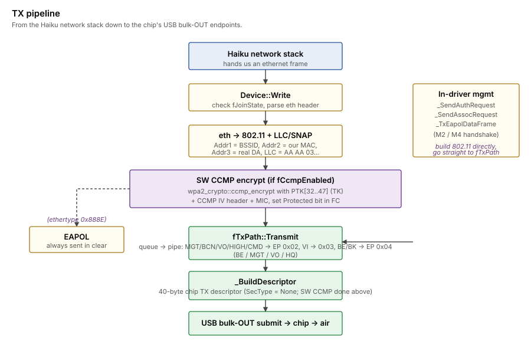

>[!NOTE]
>An LLM was used to aid in development of this code.

# TX path

How frames flow out of the kernel network stack onto the air.

## Two TX origins

Frames can originate from two places:

1.  **Network stack via `Device::Write`** — the normal data path.
    Stack hands us a 14-byte ethernet header + payload.  We convert
    to 802.11 and queue.
2.  **In-driver management** — auth-req, assoc-req, EAPOL handshake
    frames.  These are built directly as 802.11 frames in driver
    code and submitted via `fTxPath->Transmit`.  See
    `Device::_SendAuthRequest`, `_SendAssocRequest`.

## Pipeline



The data path: an ethernet frame arrives at `Device::Write`, gets
converted to an 802.11 frame, optionally encrypted via SW CCMP
(once the WPA2 handshake has installed keys), then handed to
`fTxPath->Transmit` which builds a chip-specific TX descriptor and
submits via USB bulk-OUT.  Management frames (auth-req, assoc-req,
EAPOL M2/M4) skip the eth→802.11 conversion since the driver builds
them directly as 802.11 frames already.

## Ethernet → 802.11 conversion

Stack gives us an ethernet frame:

```
[6] dst MAC | [6] src MAC | [2] ethertype | [N] payload
```

We wrap it as 802.11 infrastructure-mode data frame (ToDS=1):

```
FC byte 0 = 0x08              type=Data, subtype=0
FC byte 1 = 0x01 or 0x41      ToDS=1; Protected=1 set by SW CCMP
                              when keys are installed
Duration  = 0x003A
Addr1     = BSSID             where the frame is going (the AP)
Addr2     = our MAC           who's sending
Addr3     = real DA           original dst from the eth header
SeqCtrl   = 0                 chip fills in
LLC/SNAP  = AA AA 03          0x00 0x00 0x00 + 2-byte ethertype
[N]       payload bytes
```

Total wire frame (plaintext) = 24 (802.11 header) + 8 (LLC/SNAP) + N
(payload).  After SW CCMP encrypt it grows by 16 bytes (8-byte
CCMP IV header inserted between the 802.11 header and the LLC, plus
8-byte MIC appended at the end).

The `Addr1 = BSSID, Addr3 = real DA` mapping is crucial.  The chip's
TX scheduler routes frames based on Addr1; in infrastructure mode
that's always the AP's MAC, regardless of the real destination.
The original DA goes in Addr3 so the AP can forward to the right
station.

## SW CCMP encrypt (post-handshake)

Once the in-driver WPA2 handshake finishes and `fCcmpEnabled` is
true, every outbound data frame is encrypted in software using
`wpa2_crypto::ccmp_encrypt`.  The pairwise key (PTK[32..47] = TK)
is used for all STA-side TX — even when the logical destination
(eth `dst`) is broadcast, since the 802.11 frame is unicast at the
link layer (Addr1 = BSSID) and only the AP needs to decrypt.  The
AP re-broadcasts using its own GTK on the way out to other STAs.

EAPOL frames (ethertype 0x888E) are sent in clear regardless of
`fCcmpEnabled` — that's the 802.11i rule, the handshake itself
mustn't be encrypted.

See [wpa2-in-driver.md](wpa2-in-driver.md) for the SW CCMP design.

## TX descriptor

`TxPath::_BuildDescriptor` builds a 32-byte chip-specific descriptor
that prefixes the frame on the wire.  Notable fields:

- **dword 0**: packet length, MACID, queue selection, encryption
  type.  We always set `kSecurityNone` because crypto happens in
  software upstream of the descriptor build — the chip just
  transmits whatever bytes we hand it.
- **dword 1**: rate ID, rate adaptation flags, AGG enable
- **dword 2..7**: reserved / sequence numbers / various flags

For data frames we use:
- MACID = 1 (paired with the `RA_INFO` H2C in the post-assoc worker,
  which programs the rate-adaptation table at MACID 1).
- rate_id = 8 (OFDM rate group)
- AGG = 0 (A-MPDU aggregation disabled; the chip's Block-ACK state
  isn't wired up, so we keep transmissions single-frame).

For mgmt frames:
- MACID = 1, rate_id = 8 (same)

The chip's checksum field is included in the descriptor — without
that the chip silently drops bulk-OUT frames at submission.

## TX queues

The chip has multiple TX queues.  We use:

- **kTxQueueMGT** — auth, assoc-req, deauth, disassoc.  High
  priority, low latency.
- **kTxQueueBE** — best-effort data frames.  Most user traffic.
- **kTxQueueVO/VI/BK** — the other access categories, currently
  unused (we don't honor 802.11e prioritization).

Queue selection is in the descriptor's dword 0.

## USB submission

`fTxPath` maintains a pool of 12 USB bulk-OUT buffers.  Each
`Transmit` call takes a free buffer, builds the descriptor, copies
the frame, and submits via `usb_module->queue_bulk` to one of the
three bulk-OUT endpoints.

The three endpoints map to traffic-class buckets — endpoint 0x02 for
queue 0 (BE), 0x03 for queue 1 (mgmt), 0x04 for queue 2 (HQ).
Picking the right endpoint matters: if we submit a mgmt frame on
the BE endpoint it gets queued behind data and may not go out fast
enough to satisfy auth/assoc timeout requirements.

## TX completion

USB completion fires `_TxCallback`.  Currently we just free the
buffer back to the pool — no per-frame ack-status bookkeeping.
The chip's H2C/C2H protocol provides aggregate TX-report C2H events
(`kC2H_TxReport`) which we currently log but don't act on.

## Write() entry point

`Device::Write` is the network-stack-facing entry.  Validates the
buffer length (≥ 14 bytes for ethernet header), checks
`fJoinState == kJoinConnected` (drop frames if we're not associated),
then calls into the conversion above.  Standard pattern.
