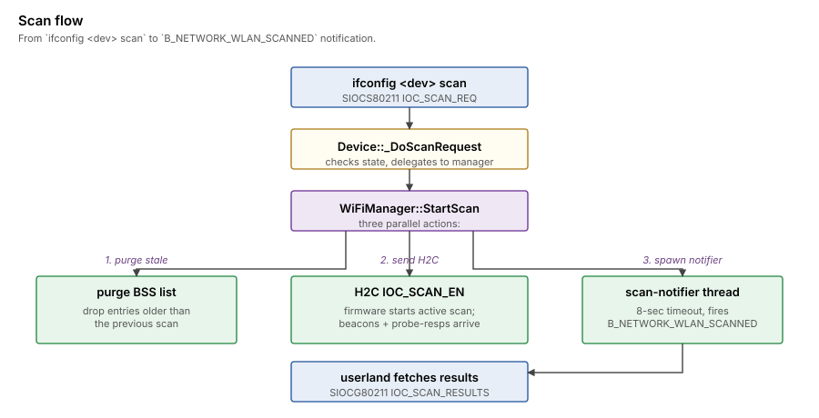

>[!NOTE]
>An LLM was used to aid in development of this code.

# Wi-Fi management

The 802.11 management plane: scanning, joining, the auth + assoc
state machine, and the firmware H2C/C2H mailbox.  Most of this lives
in `WiFiManagement.cpp` plus the join state machine in `Device.cpp`.

## Scanning



When userland issues `ifconfig <dev> scan`, the driver receives
`SIOCS80211 IOC_SCAN_REQ` and calls `_DoScanRequest`, which delegates
to `WiFiManager::StartScan`.  That fans out three things in parallel:

1. Purge stale entries from the BSS list (anything older than the
   previous scan).
2. Send an `IOC_SCAN_EN` H2C command to the firmware to start the
   active scan.
3. Spawn a one-shot scan-notifier thread with an 8-second timeout.

Beacons and probe-responses arrive while scanning is in progress.
`_RxFrameReceived` dispatches them to `_ParseBeaconOrProbe` which
adds entries to `fBssList` (max 64 BSSes, oldest entries purged).

After 8 seconds — or sooner if the firmware emits a
`kC2H_ScanComplete` event — the scan-notifier thread fires
`B_NETWORK_WLAN_SCANNED` on the network monitor port.  Userland
can then fetch results via `SIOCG80211 IOC_SCAN_RESULTS`.

The firmware-side scan completion (`kC2H_ScanComplete`) doesn't
fire reliably on the 8814AU — possibly because the WPS/SCAN-state
H2C bookkeeping the chip expects isn't documented and we haven't
reverse-engineered enough of it from the Linux reference.  The
8-second host-side fallback covers that.

## Join state machine

Driven by `Device::_DoJoin`.  Two state variables:

- `fJoinState` — `kJoinIdle` / `kJoinAuthenticating` /
  `kJoinAssociating` / `kJoinConnected`.
- (For WPA2:) `fEapolState` — see [wpa2-in-driver.md](wpa2-in-driver.md).

`_DoJoin(bssid, ssid, ssid_len)`:

1.  If we got stuck in a previous attempt (state == auth or assoc),
    log it and reset to idle.
2.  If the caller passed all-zero or broadcast bssid, look up the
    BSS by SSID in `fBssList` to recover bssid + channel.  Return
    `B_NAME_NOT_FOUND` if the network isn't in the recent scan
    list.
3.  Park the chip on the AP's channel via `PhyConfig::SetChannel`.
4.  Set MSR = `kMSR_Infra` so the chip's MAC auto-ACKs frames
    addressed to us.  Without this, the AP's responses get retried
    a few times and then we get silently kicked from the client
    table.
5.  Program `kRegBSSID` so the chip's frame filter accepts mgmt
    traffic from this BSS.
6.  Save `fJoinBssid`, `fJoinSsid`, `fJoinSsidLength`.
7.  Set `fJoinState = kJoinAuthenticating`.
8.  Call `_SendAuthRequest`.

## Auth request / response

We use only **Open System** authentication (algorithm 0).  WPA2-PSK's
key derivation runs *after* assoc as the EAPOL handshake; the open
auth is just a placeholder.

`_SendAuthRequest` builds:

```
FC: type=mgmt, subtype=Auth
DA = BSSID, SA = our MAC, BSSID = BSSID
SeqCtrl = (++fJoinSeqCounter) << 4
Body: auth_alg=0, auth_seq=1, status=0
```

`_HandleAuthResponse` checks the status code and transitions to
`kJoinAssociating`, then calls `_SendAssocRequest`.

## Assoc request / response

`_SendAssocRequest` builds the body with:

- Capability info (ESS, plus Privacy bit when `fPrivacy != 0`)
- Listen interval = 20 TUs
- SSID IE
- Supported Rates IE: 1, 2, 5.5, 11, 6, 9, 12, 18 Mbps (with the
  4 mandatory rates marked basic)
- Extended Supported Rates IE: 24, 36, 48, 54 Mbps
- RSN IE if `fWpaIeLength > 0` — set via either `IOC_APPIE` (the
  wpa_supplicant code path; doesn't actually drive the handshake on
  Haiku, but does deposit the IE), or synthesized in-driver by the
  in-driver WPA2 path when `IOC_HAIKU_JOIN` is invoked with a PMK

`_HandleAssocResponse` reads cap-info, status, AID:

```
RX assoc response cap=0x1011 status=0 aid=50
```

`cap=0x1011` = ESS + Privacy + Short Slot.  `status=0` = success.

On success:

1.  `fJoinState = kJoinConnected`.
2.  `WiFiManager::MarkConnected(bssid, ssid)` flips manager state
    so userland sees the link as up via
    `ETHER_GET_LINK_STATE`.
3.  Release `fLinkStateSem` so net_server re-polls immediately.
4.  Publish `B_NETWORK_WLAN_JOINED` so wpa_supplicant
    (when running) knows we're associated.
5.  Release `fPostAssocSem` so the post-assoc worker fires the H2C
    setup (RA_INFO + MEDIA_STATUS_RPT).

## Post-assoc worker

Synchronous USB control transfers can't run from the bulk-IN
callback context.  But the firmware needs RA_INFO programmed
*before* it'll TX our data frames at any rate other than basic;
without it the rate-adaptation table for our STA's MACID is empty
and the chip silently drops every queued data frame.

`_PostAssocLoop` runs in its own thread, blocks on `fPostAssocSem`,
and on each release issues the H2C sequence:

1.  Re-write BSSID register (idempotent with `_DoJoin`).
2.  RA_INFO H2C (cmd 0x40): MACID 0, rate_id 8 (OFDM), BW 20 MHz,
    rate mask covering OFDM 6–54 Mbps.
3.  MEDIA_STATUS_RPT H2C (cmd 0x01): connect=1, MACID=0.

After that, the chip is fully ready to TX/RX user data.  The TX
path uses MACID=1 by convention — the firmware silently drops
data frames sent on MACID=0 in some builds, and aligning the TX
descriptor's MACID with the RA_INFO slot is the documented Realtek
practice across rtwn and the morrownr Linux driver.

## H2C / C2H mailbox

The firmware exposes a host-to-card / card-to-host mailbox.  H2C
commands are 8-byte writes to `kRegH2C0` (a sequence of mailbox
slots cycles through `kH2CMailboxCount`).  C2H events come back as
4+N-byte messages over the USB interrupt-IN endpoint.

We handle a few C2H types:

| Event | Behavior |
|---|---|
| `kC2H_ScanComplete` | release the scan-done sem so the notifier fires (currently never seen in practice — fallback timeout covers it) |
| `kC2H_ConnectionStatus` | log; eventually drives reconnect logic |
| `kC2H_RateAdaptive` | log only |
| `kC2H_TxReport` | log only |
| `kC2H_Debug` | hex-dump the firmware's own debug bytes |

The interrupt-IN callback (`_InterruptCallback` in `WiFiManagement.cpp`)
re-submits itself to keep the listener alive for the lifetime of
the device.

## Disconnection

`WiFiManager::Disconnect` clears state and resets `fJoinState =
kJoinIdle`.  The driver does not currently send an explicit deauth
frame to the AP; the AP times us out instead, which usually takes a
few seconds.
