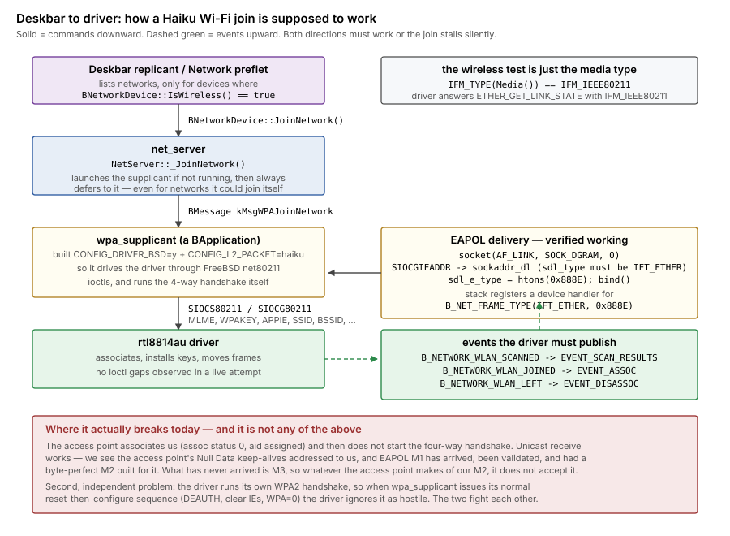

# wpa_supplicant, and connecting from the Deskbar

What has to be true for a Haiku Wi-Fi driver to be usable from the Deskbar
network menu instead of a command-line helper, what this driver already
satisfies, and what stands in the way.

This supersedes the older conclusion recorded in
[wpa2-in-driver.md](wpa2-in-driver.md) that Haiku cannot deliver EAPOL
frames to userland. **That conclusion was wrong**, and §4 shows the test
that disproves it.



## 1. The chain

Connecting from the Deskbar is not a separate code path from `ifconfig
join`. Both end up in the same place, which is useful: anything that fixes
one fixes the other.

| Step | Where | What happens |
|---|---|---|
| 1 | Deskbar replicant (`src/apps/networkstatus`) or Network preflet | Lists networks for each wireless device |
| 2 | `BNetworkDevice::JoinNetwork()` | Sends a BMessage to net_server |
| 3 | `NetServer::_JoinNetwork()` | Launches wpa_supplicant if needed, sends it `kMsgWPAJoinNetwork` |
| 4 | wpa_supplicant | Drives the driver over net80211 ioctls, runs the 4-way handshake |
| 5 | driver | Associates, installs keys, moves frames |

Two things about step 3 are worth knowing, because they remove options:

- net_server **always** defers to wpa_supplicant, even for a network it
  could join by itself. The comment in `NetServer.cpp` is explicit: it has
  to, because otherwise the supplicant would interfere. So there is no
  "just handle it in the driver" route that also works from the Deskbar.
- If wpa_supplicant is not running, net_server launches it by signature
  (`application/x-vnd.malinen-wpa_supplicant`). It is a BApplication, not a
  daemon you configure with a file.

## 2. What makes a device appear as wireless

One line, in `BNetworkDevice::IsWireless()`:

```cpp
return IFM_TYPE(Media()) == IFM_IEEE80211;
```

That is the whole test. The media type comes from the driver's
`ETHER_GET_LINK_STATE` answer, so a driver that reports `IFM_IEEE80211`
there — associated or not — shows up as wireless and gets its networks
listed. **This driver already does**, including while idle, which the boot
log confirms (`link down, media 0x80`).

## 3. The ioctl contract

wpa_supplicant on Haiku is built `CONFIG_DRIVER_BSD=y`, so the contract is
FreeBSD's net80211 — `src/drivers/driver_bsd.c`, reached through
`SIOCS80211` / `SIOCG80211` with an `ieee80211req`.

What `driver_bsd.c` touches, and where we stand:

| Implemented here | Not implemented here |
|---|---|
| `APPIE`, `AUTHMODE`, `BSSID`, `COUNTERMEASURES`, `DELKEY`, `DEVCAPS`, `DROPUNENCRYPTED`, `MLME`, `PRIVACY`, `ROAMING`, `SCAN_REQ`, `SCAN_RESULTS`, `SSID`, `WPA`, `WPAKEY` | `CHANNEL`, `KEYMGTALGS`, `MCASTCIPHER`, `MCASTKEYLEN`, `OPTIE`, `RSNCAPS`, `STA_STATS`, `UCASTCIPHERS`, `WPAIE` |

The gaps look worse than they are. In a live join attempt driven through
net_server, **the driver logged no unhandled ioctl at all** — wpa_supplicant
never got far enough to ask for the missing ones. Most of them are set
during `wpa_driver_bsd_associate`, so they become reachable only once the
earlier steps succeed. `STA_STATS` overlaps what we answer as `STA_INFO`.

Also worth noting: `SIOCGIFSTATS` (8929) arrives repeatedly and we return
`B_DEV_INVALID_IOCTL`. Harmless, but it is the source of the recurring
`Control unknown op=0x22e1` noise in syslog.

## 4. EAPOL delivery does work — the old conclusion was wrong

The in-driver WPA2 implementation exists because of a 2026-05 finding that
Haiku's `AF_LINK` stack does not deliver EAPOL (0x888E) frames to
userland, recorded at the time as a bug in Haiku's network stack. Reading
the stack and then testing it says otherwise.

**The mechanism, and it is driver-agnostic:**

1. `ethernet_deframe` (`datalink_protocols/ethernet_frame`) parses every
   received frame and sets `source.sdl_type = IFT_ETHER`,
   `source.sdl_e_type = header.type`, and for a type it does not translate,
   `buffer->type = B_NET_FRAME_TYPE(IFT_ETHER, type)`. EAPOL takes that
   default branch.
2. `device_reader_thread` deframes **before** enqueueing, so the type is
   already set by the time anything dispatches.
3. `device_consumer_thread` computes
   `B_NET_FRAME_TYPE(sdl_type, ntohs(sdl_e_type))` and hands the buffer to
   the first registered handler matching that key.
4. `LinkProtocol::Bind` registers exactly such a handler when a userland
   `AF_LINK` socket binds with a non-zero `sdl_type`.

`l2_packet_haiku.c` does precisely that: `socket(AF_LINK, SOCK_DGRAM, 0)`,
`SIOCGIFADDR` to fetch the interface's `sockaddr_dl`, then
`sdl_e_type = htons(0x888E)` and `bind()`.

**Verified on this driver** with a small test mirroring `l2_packet_haiku.c`:

```
sa_len=40 sdl_family=4 sdl_index=7 sdl_type=6 (IFT_ETHER=6) sdl_alen=6
bind(0x888E): OK -- stack accepted an EAPOL handler registration
```

The bind succeeds, so the stack accepted an EAPOL handler for our
interface. Nothing is broken in Haiku here.

Two ways the original test could have failed instead, both silent:

- `Bind` applies `ntohs()` to `sdl_e_type`, so the caller must pass
  **network** byte order. Passing host order yields a bound type of
  `0x8E88` that nothing will ever match.
- If `sdl_type` is left 0, `Bind` sets `fBoundType = 0` and registers **no
  handler at all**, then returns success.

The `sockaddr_dl` therefore has to come from `SIOCGIFADDR` rather than
being built by hand, which is exactly what `l2_packet_haiku.c` does.

## 5. The events the driver owes wpa_supplicant

On Haiku, wpa_supplicant does not read a route socket. It subscribes to
`B_NETWORK_MONITOR` notifications, and `wpa_driver_haiku_event` in
`driver_bsd.c` translates them:

| Notification | wpa_supplicant event | Meaning |
|---|---|---|
| `B_NETWORK_WLAN_SCANNED` | `EVENT_SCAN_RESULTS` | scan results are ready to fetch |
| `B_NETWORK_WLAN_JOINED` | `EVENT_ASSOC` | **association is up — start the 4-way handshake** |
| `B_NETWORK_WLAN_LEFT` | `EVENT_DISASSOC` | link went away |

`B_NETWORK_WLAN_JOINED` is the load-bearing one: without it the supplicant
never begins the handshake no matter how well EAPOL flows. The message must
carry `interface` as the device path **without** the `/dev/` prefix —
`driver_haiku_events.cpp` prepends it — so `net/rtl8814au/0`. The
reference implementation is `ieee80211_notify_node_join` in
`src/libs/compat/freebsd_wlan/net80211/ieee80211_haiku.cpp`.

This driver already publishes `SCANNED` and `JOINED` in that format.

## 6. So why does it not work yet

Two independent problems, and the first one is not about wpa_supplicant at
all.

**The four-way handshake does not complete.** This used to read "the access
point never sends us unicast", which was true of the evidence at the time and
is no longer true twice over. With the assoc request's IEs put in the right
order, M1 arrives, passes the addressed-to-us check, and the driver derives a
PTK and sends a byte-perfect M2. And unicast receive is now directly
observable in its own right: the access point's Null Data keep-alives
(subtype 4, header only) arrive addressed to us and are counted. What has
never arrived is M3. Whatever starves the in-driver handshake starves
wpa_supplicant identically, so this blocks the Deskbar route too. Tracked in
[wpa2-in-driver.md](wpa2-in-driver.md).

**net_server undoes its own join.** Joining an open network has to go through
net_server, because there is no passphrase for `wifi-join` to take. Doing so
associates and then immediately tears the association down:

```
IOC_MLME op=1(ASSOC)  reason=0  mac=…
IOC_MLME op=3(DEAUTH) reason=3  mac=…
```

Reason 3 is `IEEE80211_REASON_AUTH_LEAVE`, which is what
`NetServer::_LeaveNetwork` sends — and it still happens with wpa_supplicant
killed outright, so this is net_server itself, not the supplicant. The
practical effect is that the open-network path cannot hold an association,
which is worth knowing before blaming the driver's transmit path for a failed
DHCP.

**The in-driver handshake fights the supplicant.** wpa_supplicant opens by
resetting driver state — `IOC_MLME` DEAUTH, clear the IEs, `IOC_WPA` 0 —
before configuring its own session. That is normal. But this driver runs
its own handshake, so it treats those as interference:

```
IOC_MLME op=3(DEAUTH) reason=3 mac=…
ignoring external DEAUTH during in-driver WPA2 handshake (eapolState=1)
IOC_APPIE WPA: cleared
IOC_WPA SET 0
```

Both cannot own the handshake. As long as the driver does, the Deskbar path
cannot work even after the receive bug is fixed.

## 7. Getting to a Deskbar connect

In order, because each step only matters once the previous one holds:

1. **Fix unicast receive.** Nothing else can be tested until an EAPOL M1
   reaches the host. Everything below is blocked on it.
2. **Add a supplicant-owned mode.** Keep the in-driver handshake for the
   `wifi-join` path, but when wpa_supplicant is driving — signalled clearly
   by `IOC_WPA` being set and IEs arriving via `IOC_APPIE` — stand down:
   honour DEAUTH, install the keys it gives us through `IOC_WPAKEY`, and do
   not run our own state machine. The two must not both be live.
3. **Fill the remaining ioctls** as wpa_supplicant reaches them —
   `UCASTCIPHERS`, `MCASTCIPHER`, `MCASTKEYLEN`, `KEYMGTALGS`, `RSNCAPS`,
   `WPAIE`, `OPTIE`, `CHANNEL`. Add them driven by the log, not
   speculatively; an unhandled one shows up immediately as
   `Control unknown op`.
4. **Answer `SIOCGIFSTATS`** to stop the recurring unknown-ioctl noise, so
   that log stays a useful signal.

The encouraging part is what is *not* on this list: the media type is
right, so we already appear as wireless; the scan and join notifications
are already published in the right format; the EAPOL transport works; and a
real join attempt found no missing ioctl. The Deskbar path is closer than
the in-driver detour suggests.
