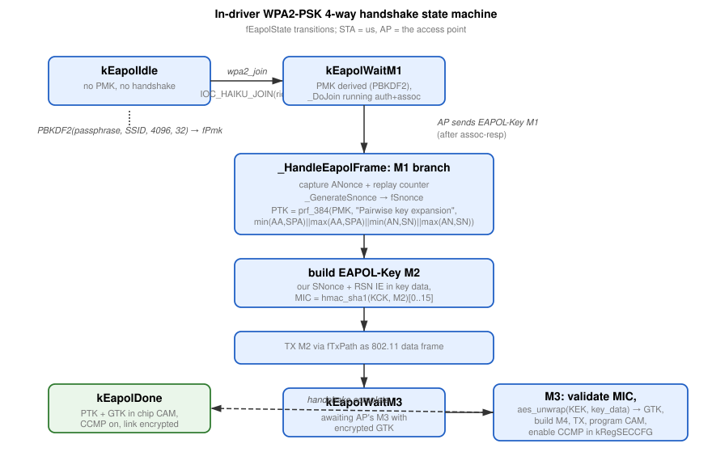
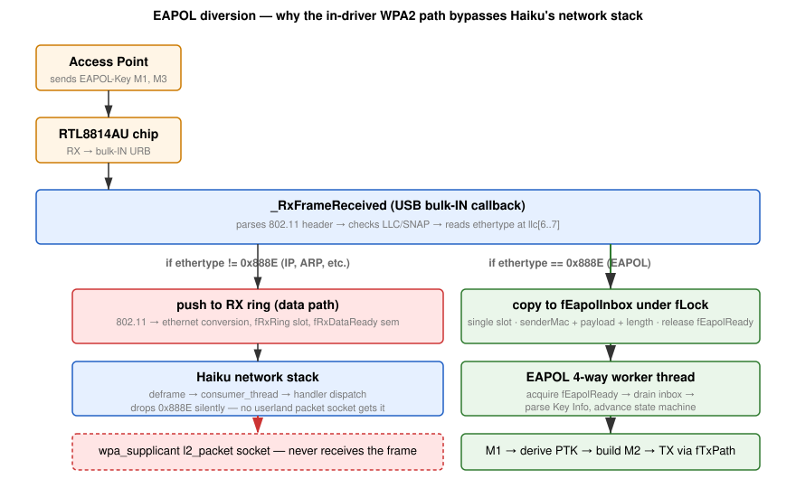

>[!NOTE]
>An LLM was used to aid in development of this code.

# In-driver WPA2-PSK

The rtl8814au driver runs the entire WPA2-PSK 4-way handshake **inside
the kernel driver** rather than delegating to `wpa_supplicant`, and
performs AES-CCMP encrypt + decrypt for the data path in software on
the host CPU rather than relying on the chip's hardware crypto engine.

Both of those are unusual choices — most Wi-Fi drivers on every
platform delegate the handshake to userspace and let the chip do
crypto in hardware.  The motivation for each is a concrete bug we
hit and couldn't work around any other way.  This page documents
the design and the rationale.

## Why not `wpa_supplicant`?

Haiku ships `wpa_supplicant 2.11` (HaikuPorts package).  It's a
`BApplication` that net_server launches when an interface joins a
WPA-secured network.  It uses the FreeBSD `driver_bsd.c` backend —
the same one any FreeBSD-derived Wi-Fi driver expects — so it talks
to the driver via `SIOCS80211` / `SIOCG80211` ioctls plus an `AF_LINK`
packet socket bound to ethertype 0x888E for EAPOL frames.

The ioctl side works fine.  `wpa_driver_bsd_init`,
`bsd_set_mediaopt`, `IOC_DEVCAPS`, `IOC_WPA`, `IOC_PRIVACY`,
`IOC_AUTHMODE`, `IOC_DROPUNENCRYPTED`, `IOC_APPIE`, `IOC_MLME` (ASSOC
and DEAUTH), `IOC_DELKEY`, `IOC_COUNTERMEASURES` — wpa_supplicant
successfully drives the driver to associate and the AP issues an AID.

What never works is the EAPOL layer.

### What we thought we proved — and why it was wrong

**This section used to claim that Haiku cannot deliver ethertype 0x888E to
userland, and that the in-driver handshake exists to work around a kernel
bug. That claim is false.** It is left here, corrected, because the wrong
version shaped this driver's whole design and someone will otherwise
re-derive it.

The original test bound an `AF_LINK` socket to 0x888E exactly as
`l2_packet_haiku.c` does, and `recvfrom` never returned. That was read as
"the frames go missing between `device_consumer_thread` and the registered
handler". Re-testing the same thing says otherwise:

```
sa_len=40 sdl_family=4 sdl_index=7 sdl_type=6 (IFT_ETHER=6) sdl_alen=6
bind(0x888E): OK -- stack accepted an EAPOL handler registration
```

The bind succeeds and the stack really does register a handler for
`B_NET_FRAME_TYPE(IFT_ETHER, 0x888E)`. The delivery path is sound and
entirely driver-agnostic — `ethernet_deframe` tags every frame with
`sdl_e_type`, the reader thread deframes before enqueueing, and the consumer
thread dispatches on that key. `recvfrom` returned nothing because **no
EAPOL frame was arriving at the time**, which is a different problem
entirely and is still open (see the status section below).

Two silent ways that test can fail regardless of the stack, both of which
produce a bind that reports success and then receives nothing:

- `LinkProtocol::Bind` applies `ntohs()` to `sdl_e_type`, so the caller must
  pass **network** byte order. Host order binds `0x8E88` and matches nothing.
- If `sdl_type` is left 0, `Bind` registers **no handler at all** and still
  returns `B_OK`. Take the `sockaddr_dl` from `SIOCGIFADDR`; never build it
  by hand.

See [wpa-supplicant-and-deskbar.md](wpa-supplicant-and-deskbar.md) for the
full path through the stack and for what it would take to hand the handshake
back to `wpa_supplicant` — which is also the only route to connecting from
the Deskbar.

## Why not hardware CCMP?

The RTL8814AU has a hardware crypto engine and a 32-entry security
CAM.  The Linux reference driver uses it; rtwn uses it; every other
Realtek STA driver uses it.  The driver still **programs** the CAM
correctly post-handshake — CAM[1] holds the GTK with the group-key
flag (`BIT(6)`) set, CAM[4] holds the pairwise TK keyed to the AP's
MAC — and verifies the entries via the readback path.

But with the SECCFG register set per morrownr's reference (`0x01CC` =
TxEnable + RxDecEnable + TxBcKeyDef + RxBcKeyDef + CHK_KEYID), the
chip's HW decrypt engine **declines to decrypt** incoming Protected
frames.  Every CCMP-encrypted broadcast we receive comes up with
the `SWDEC` bit set in the RX descriptor (bit 27 of dword 0), which
is the chip telling the host "please decrypt this in software, I
won't."  And with `SCR_RxDecEnable` set the chip then silently
**drops** those same frames after signaling SWDEC, leaving the
host with no way to see them at all.

We tried every relevant variant: BIT(6) group flag, RCR bit-position
fixes (CBSSID_DATA + CBSSID_BCN at the correct 8814au bit positions
6 and 7, not the r92c-era 12 and 13 that some headers list),
REG_MAR opening, atomic BSSID writes, CHK_KEYID, NoSKMC.  The chip
still refused.  Without the Realtek datasheet to consult, we don't
know what register or H2C command makes the engine cooperate.

The fix is to clear `SCR_RxDecEnable` (chip stops silently dropping
encrypted frames and passes them through untouched), then decrypt
in software.  TX side is symmetric — we never trusted HW encrypt
once HW decrypt was clearly broken.  Final SECCFG = `0`; the chip
does no crypto in either direction.

The cost is some CPU time per data frame (AES-128 in software,
~150 ns/block on a modern x86 core).  At 802.11ac line rates that's
noticeable but not catastrophic; the driver is not going to saturate
gigabit wireless on this hardware in any case.  Once we figure out
what the chip wants and HW crypto becomes available, the SW path
can stay as a fallback — the keys are already in CAM, just bring
SECCFG back to `0x01CC`.

## The end-to-end handshake



EAPOL frames never leave the driver:



### Walkthrough

1.  An associated STA brings up WPA2-PSK on the device (via a userland
    helper that opens the device fd and issues
    `SIOCS80211 IOC_HAIKU_JOIN` with a custom `rtl_haiku_join_psk`
    payload of `{bssid, ssid, passphrase}`).
2.  Driver runs `pbkdf2_hmac_sha1(passphrase, ssid, 4096, 32)` to
    derive the 32-byte PMK.
3.  Driver runs `_DoJoin` — sets channel, writes BSSID register,
    drives auth + assoc.  The assoc-req carries an RSN IE synthesized
    in-driver (for the standard AKM 00-0F-AC:2 PSK with CCMP cipher).
4.  AP sends EAPOL-Key M1.  `_RxFrameReceived` notices ethertype
    0x888E and copies the payload into `fEapolInbox` instead of
    pushing it to the data ring (where Haiku's stack would drop
    it).
5.  EAPOL worker thread wakes on `fEapolReady`, parses M1, captures
    the AP's ANonce.
6.  Driver generates SNonce by mixing `system_time +
    real_time_clock_usecs + our MAC + counter` through SHA-1.
7.  Driver derives PTK = `prf_384(PMK, "Pairwise key expansion",
    min/max(AA,SPA) || min/max(ANonce,SNonce))` and splits it into
    `KCK[0..15] || KEK[16..31] || TK[32..47]`.
8.  Driver builds EAPOL-Key M2 with our SNonce + RSN IE in key
    data, computes `MIC = hmac_sha1(KCK, M2_with_MIC_zeroed)[0..15]`,
    patches it into the MIC field, TXes via `fTxPath` as a data
    frame (802.11 header + LLC/SNAP + ethertype 0x888E + EAPOL
    bytes).
9.  AP sends M3 with encrypted GTK in key data.  Driver validates
    the MIC against KCK (hashing exactly `4 + body_length` bytes
    of the EAPOL frame, not the chip-reported `frameLen` — the
    chip's RX length includes the trailing FCS that the AP didn't
    cover in its MIC).  Then unwraps the GTK using
    `aes_unwrap(KEK, ...)` per RFC 3394.
10. Driver builds M4 (no key data, secure bit set in Key Info, MIC
    over the frame with the MIC field zeroed), TXes via `fTxPath`.
11. Driver programs both keys into the chip's security CAM:
    CAM[gtk_keyid] = group key with `BIT(6)` (group flag),
    `BIT(15)` (valid), `ALGO=AES`, MAC=00:00:00:00:00:00 (per the
    rtwn / morrownr convention for default-key entries 0..3); and
    CAM[4] = pairwise TK, `BIT(15)`, `ALGO=AES`, MAC = AP BSSID.
12. Driver leaves `kRegSECCFG = 0` and switches the data path to
    SW CCMP (see below).  `fCcmpEnabled` is set true; `Write()`
    and `_RxFrameReceived` from here on encrypt/decrypt every
    non-EAPOL data frame in software.

After step 12 the connection is fully usable.  DHCP runs over
SW-encrypted frames, gets an OFFER + ACK back over SW-decrypted
frames, and the link is functionally indistinguishable from a
HW-CCMP connection except for CPU cost.

## SW CCMP (`wpa2_crypto::ccmp_encrypt` / `ccmp_decrypt`)

The two functions in `WPA2Crypto.cpp` implement the IEEE 802.11i
CCMP scheme directly (AES-CCM with `M=8`, `L=2`, 13-byte nonce,
22- or 24-byte AAD for non-QoS / QoS data frames).  Both are
straightforward textbook implementations on top of the existing
`aes128_encrypt` primitive — no third-party library.

Details worth knowing:

- **STA always uses the pairwise key for TX**, even when the eth
  destination is broadcast.  At the 802.11 layer the frame is
  unicast to BSSID (Addr1 = BSSID); only the AP needs to decrypt,
  and it does so with the pairwise key.  The AP re-broadcasts to
  other STAs using its own GTK.  Using GTK for our broadcast TX
  was an early bug — AP couldn't decrypt and silently dropped
  every DHCP_DISCOVER.
- **TX PN counter** is per-key and must be strictly monotonic
  for the AP to accept frames; the driver maintains
  `fTxPnPairwise` (used for all outbound) and `fTxPnGroup` (kept
  but unused in STA mode), both reset to `1` each time keys are
  reinstalled.
- **Protected bit must be set in FC[1] BEFORE building AAD.**  Both
  sender and receiver fold the masked FC byte into AES-CBC-MAC, and
  both use Protected=1 in their AAD.  Setting Protected only after
  the MIC is computed produces a MIC the AP can't validate.
- **EAPOL frames stay unencrypted** even after `fCcmpEnabled` is
  set; that's the 802.11i rule — the handshake itself is in clear.

### Crypto primitives (`WPA2Crypto.cpp`)

All implementations are kernel-side, no allocations, no globals
other than const tables.  Compact textbook implementations rather
than vendoring a third-party library.

| Primitive | Purpose | Source |
|---|---|---|
| `sha1` | Used internally by HMAC-SHA1 | RFC 3174 reference |
| `hmac_sha1` | EAPOL-Key MIC, PTK derivation, PBKDF2 | RFC 2104 |
| `pbkdf2_hmac_sha1` | Derive PMK from passphrase + SSID | RFC 2898 §5.2.  4096 iterations per WPA2-PSK |
| `prf_384` | Derive PTK from PMK + nonces + MAC addresses | IEEE 802.11i §8.5.1.1 |
| `aes128_encrypt` / `aes128_decrypt` | AES-128 ECB block cipher | FIPS 197 textbook impl using S-box + inverse S-box (no T-tables — keeps the static-data footprint small) |
| `aes_unwrap` | Decrypt the GTK delivered in M3's key data | RFC 3394 §2.2.2 |
| `ccmp_decrypt` | AES-CCM decrypt for incoming Protected frames | IEEE 802.11-2012 §11.4.4 |
| `ccmp_encrypt` | AES-CCM encrypt for outgoing Protected frames | IEEE 802.11-2012 §11.4.4 |

## Threading

The handshake runs entirely on the EAPOL worker thread
(`_Eapol4WayLoop` in `Device.cpp`).  Spawned at hardware-init time,
blocks on `fEapolReady`, drains `fEapolInbox` under `fLock`, advances
the state machine.  The thread is the **only** writer of
`fEapolState`, `fAnonce`, `fSnonce`, `fPtk[]` — no further locking
needed for those.

Why a dedicated thread instead of processing inline in
`_RxFrameReceived`:

1.  `_RxFrameReceived` runs from the USB bulk-IN callback context.
    It must not block on synchronous USB control transfers, but
    programming the chip's CAM (step 11) requires exactly that.
2.  PBKDF2 takes ~1 ms.  We don't want it on the bulk-IN path.

SW CCMP encrypt + decrypt do **not** use this thread — they run
inline in `Device::Write` and `Device::_RxFrameReceived` respectively,
since both are bounded work (~150 ns/AES-block) and the cost of a
context-switch would dwarf the win.

## State stored on the device

`Device.h`:

```c
EapolState   fEapolState;          // Idle / WaitM1 / WaitM3 / Done
uint8        fAnonce[32];          // captured from M1
uint8        fSnonce[32];          // generated for M2
uint8        fPmk[32];             // derived from PBKDF2
bool         fPmkValid;
uint8        fPtk[48];             // KCK || KEK || TK
bool         fPtkValid;
uint64       fM1ReplayCounter;     // echoed in M2

EapolFrame   fEapolInbox;          // single-slot, mutex-protected
bool         fEapolPending;
sem_id       fEapolReady;

uint8        fGtk[16];             // group key stashed for SW decrypt
uint8        fGtkKeyId;            // group key id from M3 KDE
bool         fGtkValid;

bool         fCcmpEnabled;         // true after step 12
uint64       fTxPnPairwise;        // outbound CCMP PN counter
uint64       fTxPnGroup;           // (unused in STA mode)
```

The inbox is single-slot because the handshake is strictly
one-message-at-a-time per peer and we have only one BSS to talk to.


## Two requirements that are easy to get wrong, and cost a day each

### Information elements go in ascending element-ID order

The assoc request must emit its IEs in ascending element-ID order: SSID (0),
Supported Rates (1), **RSN (48)**, Extended Supported Rates (50). Emitting
50 before 48 broke association in two different ways depending on how strict
the access point was, and neither looked like an ordering problem:

- A phone hotspot **dropped the assoc request outright** — no assoc response
  at all, no deauth, nothing on the air.
- A home router **accepted it, replied status 0 with an AID, and then ignored
  us forever.** It had stopped parsing at the out-of-order element, never saw
  the RSN IE, concluded we were a non-RSN station, and so never sent M1. It
  never deauthed us either, because from its side nothing was wrong.

That second failure presents as "we associate and the access point then
ignores us", which sends you looking at receive filters, MAC registers and
crypto — none of which are wrong. The way to find it is to associate to the
**same** access point twice, once open and once with WPA2. If open works and
WPA2 does not, the fault is in the assoc request, not in receive.

### Management and EAPOL frames must be checked as addressed to us

`RCR` has `AMF` set, so the chip delivers **every** management frame on the
channel — including the auth and assoc responses the access point sends to
its other stations. A handler that checks only `addr2 == BSSID` will happily
accept someone else's success:

```c
if (memcmp(frame + 10, fJoinBssid, 6) != 0)   // from our AP
    return;
if (memcmp(frame + 4, fMacAddress, 6) != 0)   // ...and to US
    return;
```

Without the second check a busy access point makes the driver believe it
authenticated and associated when its own request never got through. The
give-away is the **AID changing between runs** — we saw 45, 46, 17, then 1,
which were other stations' AIDs. The same applies to the EAPOL diversion:
handshake frames are always unicast to us, and adopting another station's M1
would derive a PTK against the wrong ANonce.

## Verifying the handshake arithmetic off-box

When the access point rejects M2, the useful question is whether our
arithmetic is wrong or our frame never arrived. The whole derivation can be
checked away from the driver, because everything it depends on is either
known or sent in the clear. Log the ANonce and the finished M2 in hex, then:

1. `PMK = pbkdf2_hmac('sha1', passphrase, ssid, 4096, 32)`
2. `PTK = PRF-384(PMK, "Pairwise key expansion",
   min(AA,SPA) || max(AA,SPA) || min(ANonce,SNonce) || max(ANonce,SNonce))`
   — 76 bytes of data, SNonce read out of M2 at offset 17
3. `MIC = HMAC-SHA1(PTK[0:16], M2 with the MIC field zeroed)[0:16]`
   and compare against M2 offsets 81..96

Done for a real handshake, every part matched: EAPOL header, `keyInfo`
`0x010a`, key length 0, the replay counter echo, the SNonce, `keyDataLen` 22
and a valid CCMP/CCMP/PSK RSN IE in key data, and the MIC. **So the crypto
and the M2 builder are not where to look.** No key material needs logging for
this — the ANonce and M2 both travel in the clear during a normal handshake.

## Status

**The handshake works.** As of 2026-08-20 the full sequence completes and the
link carries traffic:

```
EAPOL M1 -> built M2 -> EAPOL M3 (keyInfo=0x13ca, keyDataLen=56)
M3 GTK extracted: keyId=2 len=16
CAM programmed: TK@4 (AES, peer) GTK@2 (AES, keyid=2)
EAPOL state -> Done (M4 sent; CCMP enabled)
```

Then DHCP obtains a lease and the interface passes ICMP at every payload size
and full TCP sessions. Reproduced from a clean boot.

### What was actually wrong

For a long time this section read "the access point does not accept M2", and
the natural suspects were the crypto and the M2 builder. Both were innocent,
and proving it took a byte-for-byte comparison against a **known-good M2**
captured from the vendor Linux driver on the same chip and access point:
descriptor type, key info `0x010a`, key length, replay counter, key data
length 22 and the whole RSN IE in the key data were **identical**. Only the
nonce and MIC differed, as they must.

The frame was always right. It was not reaching the access point, and the
causes were in the transmit path and the MAC configuration — sixteen distinct
defects in total. The two that finished it:

- **`REG_CR` was written with two bits that do not exist** — `(1 << 13)` and
  `(1 << 14)`. `REG_CR`'s defined bits stop at bit 10, so those were reserved,
  and the security engine (`ENSEC`, bit 9) was never enabled at all.
- **Uplink frames were mislabelled as 802.11 broadcast.** The transmit path
  took its broadcast flag from the *Ethernet* destination, but the descriptor's
  `BMC` bit describes the *802.11 receiver address* — and a station always
  sends uplink as unicast to the access point. DHCP DISCOVER goes to
  `ff:ff:ff:ff:ff:ff`, so it went out group-addressed with no acknowledgement
  expected and the wrong MACID. This is why the handshake could complete while
  DHCP still failed.

The earlier entries in this file — the IE ordering requirement, the
addressed-to-us validation, the descriptor field errors — remain accurate and
are still worth reading; they were each necessary.

### The test access points are not equivalent — this matters

- **The phone hotspot is a very weak transmitter.** Measured at **-86 dBm
  with a bad FCS from eight feet away**, where a phone should be nearer -45.
  It sends M1 and ignores our M2, but on a link that marginal, "ignored" and
  "never received" are indistinguishable. It also auto-disables on inactivity
  and re-randomises its BSSID across restarts. Convenient for A/B testing
  open versus WPA2 on the same radio; a poor choice for anything where signal
  quality is a variable.
- **The home router is strong** (-62 dBm at the same monitor) but
  **associates us and never sends M1 at all** — a different failure, and one
  that is at least not explainable by link margin.

Any conclusion drawn from one of these alone should be checked against the
other, and ideally against a third, stronger access point.
